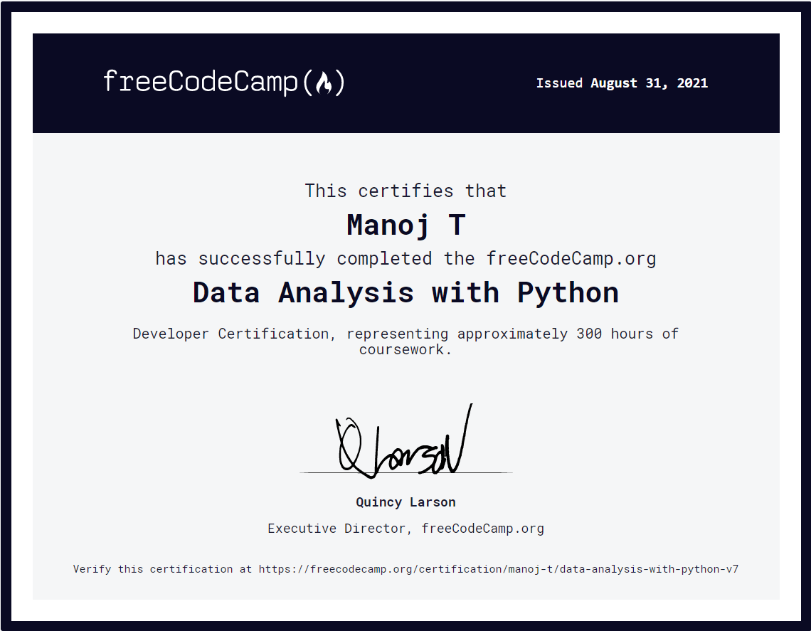

# FreeCodeCamp-DataAnalysis-With-Python

This repository contains my algorithm solutions for freeCodeCamp's Data Analysis with Python Projects certificate.

You can view the algorithm problems 👉[here](https://www.freecodecamp.org/learn/data-analysis-with-python/#data-analysis-with-python-projects) and my certificate 👉[here](https://www.freecodecamp.org/certification/manoj-t/data-analysis-with-python-v7).

